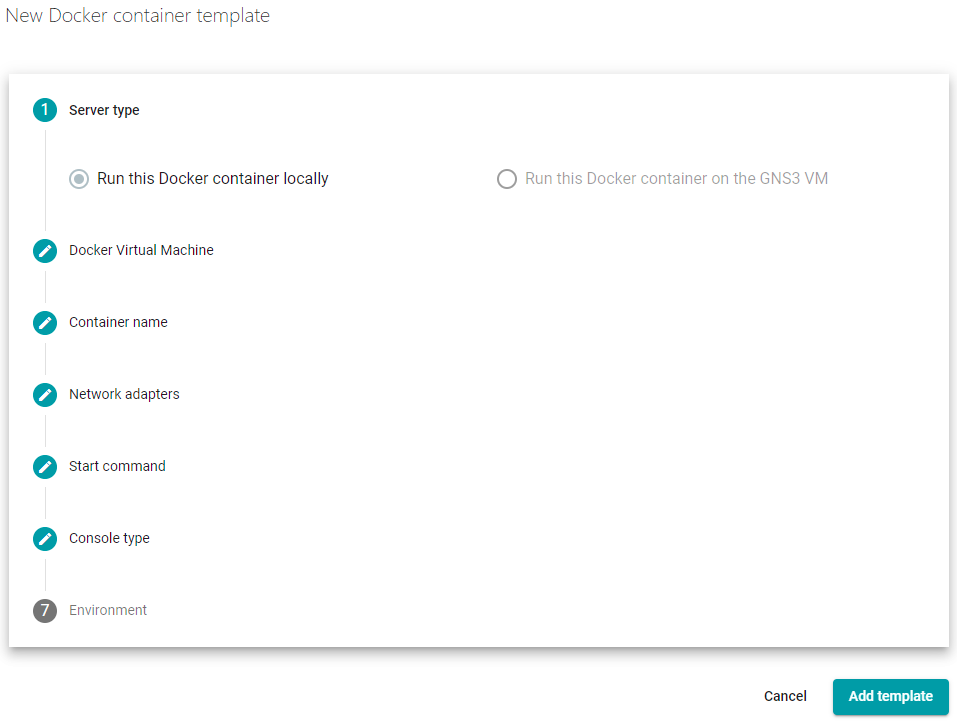
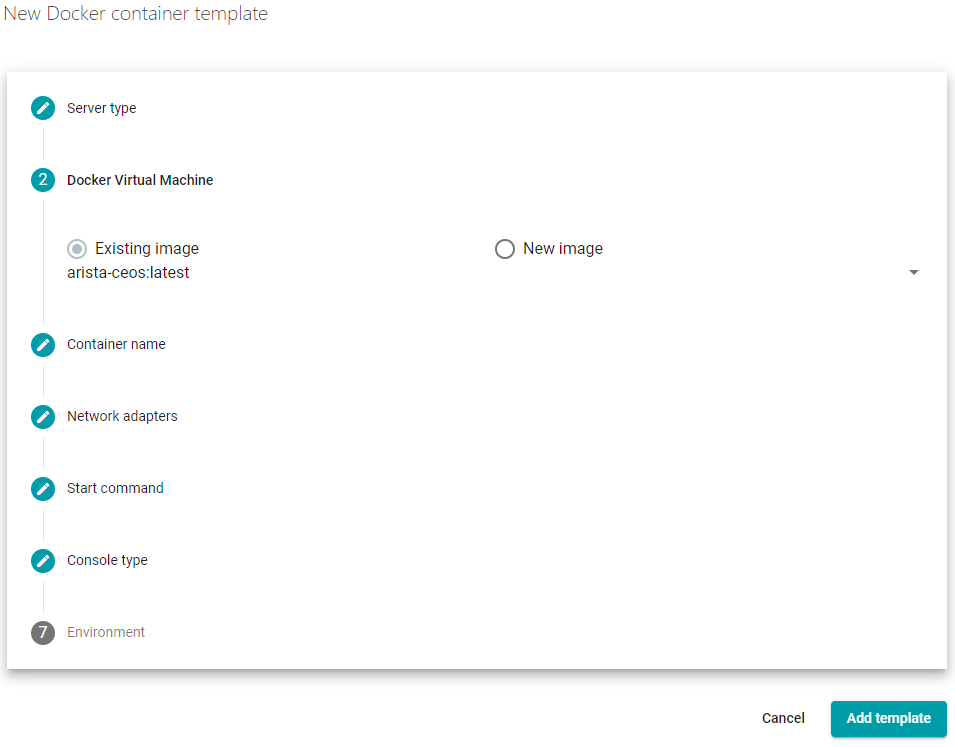
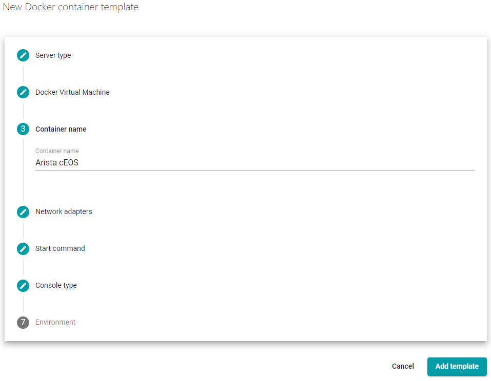
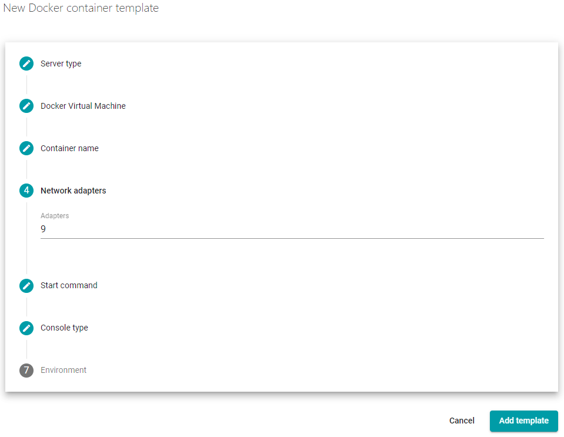
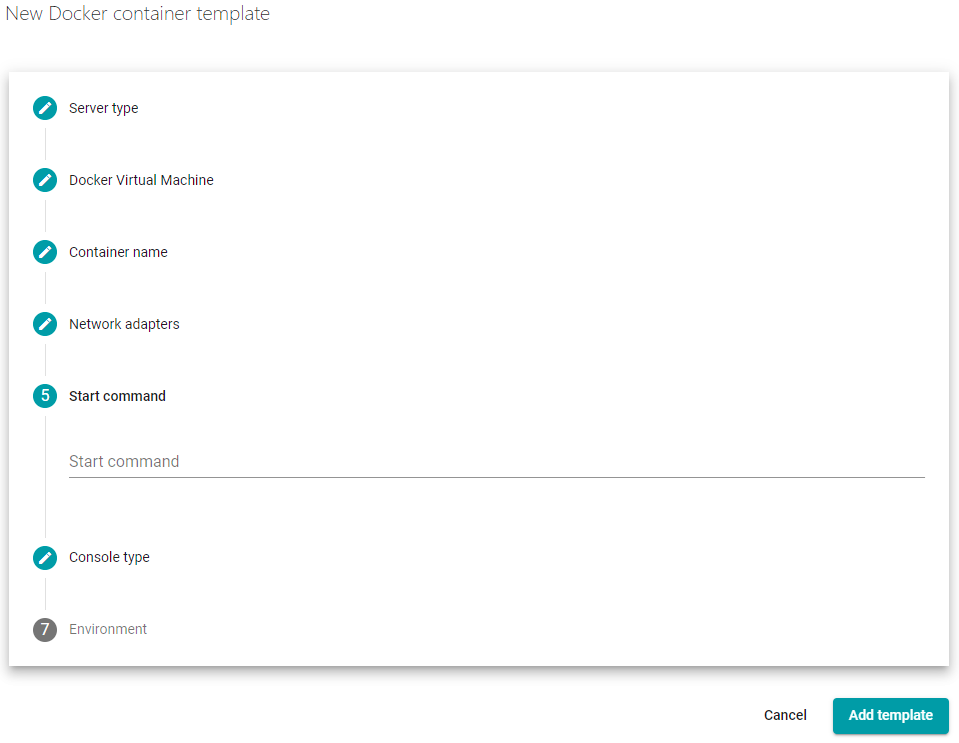
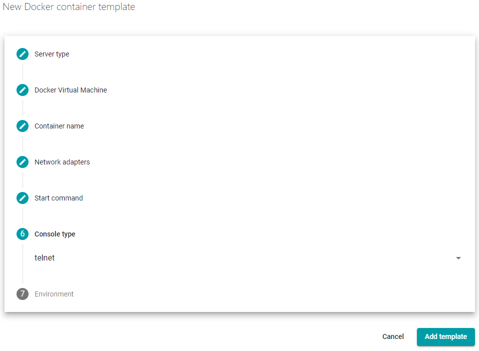
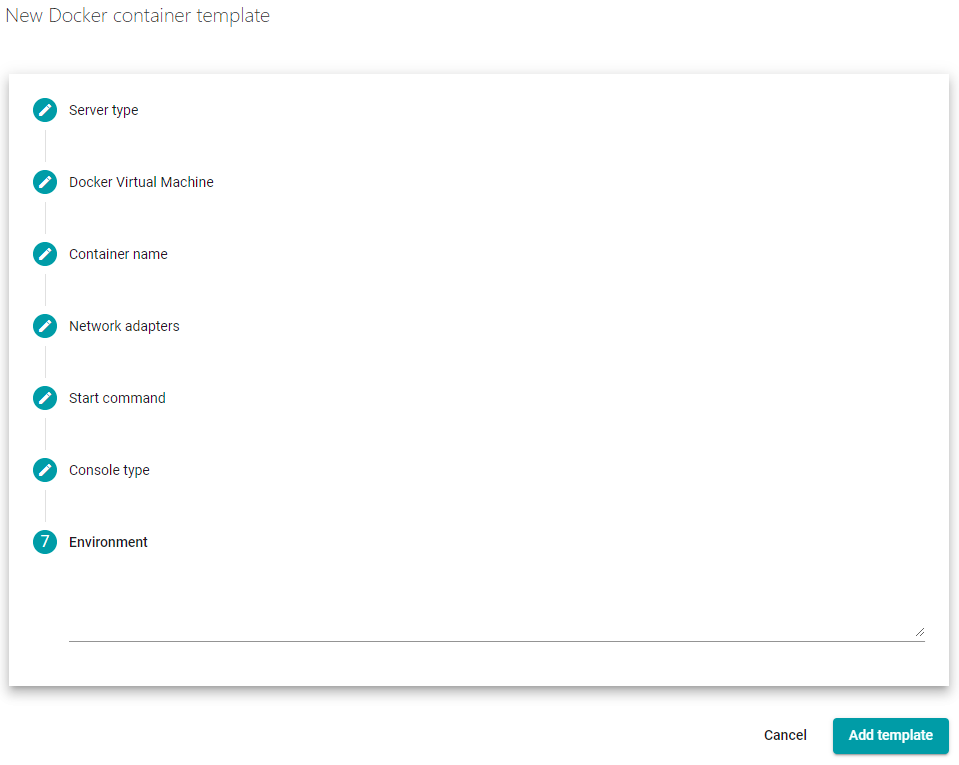
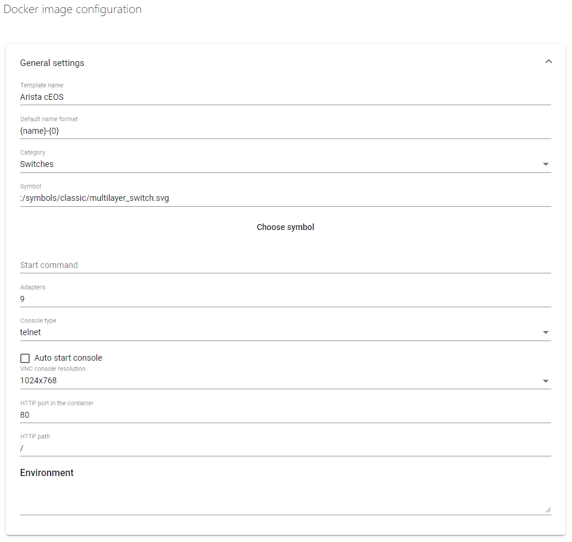
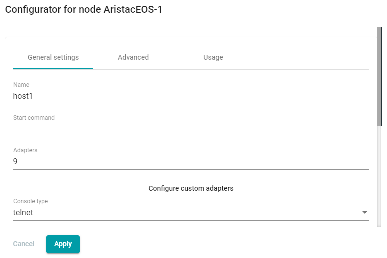

# How to use in GNS3

## Create the template

Go to `Preferences` -> `Docker` -> `Add Docker container template`, then fill-up
the form like:

After, you can edit the template to adjust the category and the icon:

## Add instance in a lab

Click the Add (`+`) button, drag Arista cEOS on the lab, then configure the
hostname and interface count as wished. If `Start command` is required, put a
simple space.

